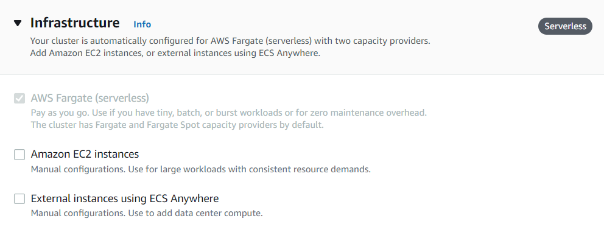
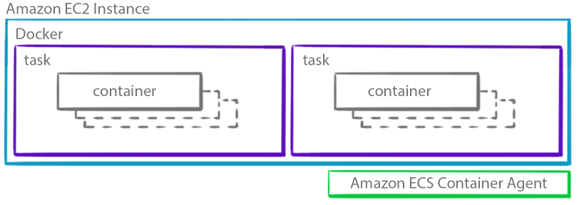
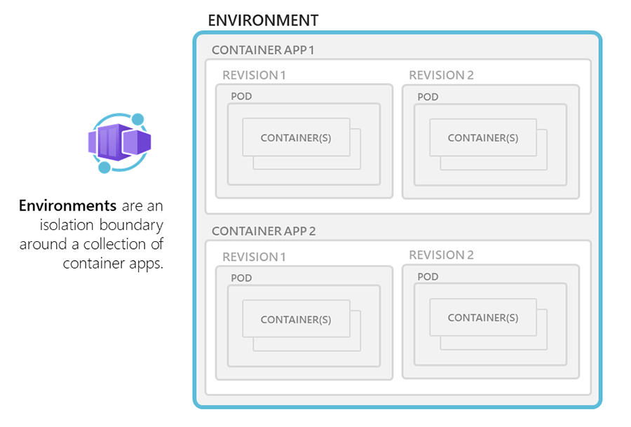
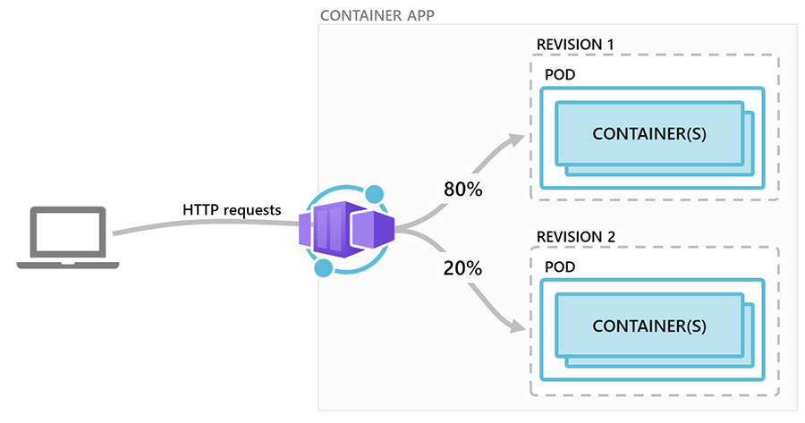

# Azure Container Apps compared with AWS Elastic Container Service
### Agenda
* Overview to Azure Container Apps and AWS Elastic Container Services
* High level view of AWS ECS components
* High level view of Azure Container App components
* Comparison of AWS ECS and Azure Container App components
* Features of ECS and Container Apps

Recently Microsoft released their new serverless service for running containers on Azure platform - Azure Container Apps. It is still in public preview and not ready for production. Microsoft announced the **Public Preview** of the service in November 2021. This service closely resembles AWS's well matured container deployment service - Elastic Container Service aka ECS. 

AWS announced the General Availability (GA) of the ECS services in April 2015. Initially it was started as a container deployment service backed by EC2 instances and was supporting only Linux containers. Later in December 2016 they added support for Windows Server 2016 containers (beta). In November 2017, Fargate launch type support was added to run containers on a serverless fashion. Fargate is a serverless, pay-as-you-go compute engine for deploying containers that currently supports Elastic Container Service (ECS) and Elastic Kubernetes Service (EKS). 

Microsoft launched the public preview of their new container deployment service - Azure Container Apps - in November 2021. It is still in the evaluation phase and not matured enough to run production workloads, you need to wait some more time for the general availability of the service. During public preview it is only available in limited regions including Canada Central, West Europe, North Europe, East US, East US2. You can deploy the *Container Apps* using Azure Portal, CLI or ARM template. To deploy with Azure CLI, you need to add extension for `containerapp`. (az extension add --name containerapp --upgrade). Since the Container Apps resources are migrating from *Microsoft.Web* namespace to *Microsoft.App* namespace, you need to register the namespace using `az provider register --namespace Microsoft.App` command.

## High level view of AWS Elastic Container Service (ECS)
The primary component of the ECS service is the **ECS cluster**. As per the AWS documentation a cluster is a *logical grouping of tasks or services*. It provides the infrastructure support for running containerized applications using Fargate, ECS instances or the on-premises servers or virtual machines that you manage on your data center. Every ECS cluster is deployed in a VPC which can be a default VPC or a custom VPC created by user. You can optionally enable the *Container Insights* feature that can collect metrics for many resources, such as CPU, memory, disk, and network. Container Insights also provides diagnostic information, such as container restart failures, that you use to isolate issues and resolve them quickly.

||
|:--:|
|**Image 1: ECS capacity providers - Fargate, EC2 instances and external**|

To deploy your containers on ECS cluster, you need to define the **Task Definitions**. A Task Definition tells how many containers to run, CPU and memory allocation for containers, port configurations for containers, launch type compatibility and the OS family. The launch type compatibility can be Fargate, EC2 or external. Task definition also allows to configure the AWS App Mesh which is based on the *envoy proxy* that makes it easy to monitor and control microservices. It provides a standardization for microservices communication, end-to-end visibility and ensure high availability. In a container definition you can define one or more containers that you want to launch together as a single task. While configuring the containers, you can specify the container name, image name, port mappings, health check and environment variables.

||
|:--:| 
|**Image 2: Task definition with Fargate launch type**|

||
|:--:| 
|**Image 3: Task definition with EC2 launch type**|

A **service** in ECS allows you to run a specific number of instances of a task definition in the cluster. Service will ensure the high availability of the containers by recreating the containers on failure. Containers will run as a task which is managed by the service. Every EC2 instances runs an ECS container agent that allows containers to connect to the cluster. ECS optimized AMIs comes with the ECS container agent preinstalled.

||
|:--:| 
|**Image 4: Task placement in EC2**|

## High level view of Azure Container Apps
Azure Container Apps enables you to run your containerized applications in a serverless environment. Behind the scenes it runs containers on Azure Kubernetes Service with Dapr, Envoy and KEDA support. It allows you to run your API services, Background processing apps, Event Driven applications and microservices. It provides the *Http ingress* support which allows you to access the web applications running in Container Apps using Http or Https. Container Apps can scale containers automatically based on CPU and memory usage, Http traffic, Queues or any KEDA (Kubernetes Event Driven Autoscaling) supported parameters. 

Azure Container Apps is still in Public Preview and when it comes into GA you may see lot of changes compared to current preview version of Container Apps. In Container Apps you need to create a **Container App Environment** which is defining the boundary for individual Container Apps. It logically groups multiple Container Apps that shares same Virtual Network and write logs into same Log Analytics workspace. You can deploy Container App Environment in an existing Virtual network also. You may deploy your Container Apps in same Environment when your applications need to communicate using Dapr and they share the same Dapr configuration. 

||
|:--:| 
|**Image 5: Container App Environment**|

Application in Container Apps runs in **revisions**. A revision is an immutable snapshot of the Container App. When you create a container app instance it automatically creates a revision for you. Later, whenever you make changes in the container configurations,  it creates a new revision for you. You can run revisions in a *Single* or *Multiple* mode. In single revision mode only a single revision of the container app will serve all requests. In multiple mode, you can run multiple revisions of the application and split traffic across those revisions. It is good strategy for A/B testing and BlueGreen deployments. The total percentage of traffic for all revisions should be 100. Containers in a revision runs inside the **Pods**. A single pod can run one or more containers inside it. 

||
|:--:| 
|**Image 6: Traffic splitting for revisions**|

## Components of AWS ECS and Azure Container Apps

|ECS               |Container Apps             |Description                     |
|------------------|---------------------------|--------------------------------|
|Cluster           | Container App Environment | ECS cluster is a logical grouping of services and tasks. A Container App Environment is a secure boundary for grouping container Apps.                               |
|Task Definitions  | Revisions                 | A task definition in ECS defines the task configurations and launch type compatibility. A revision in Container App is an immutable snapshot of container app that defines the container (Pod) and traffic configurations.                                 |
|Services          | Revision/scale setting    | A service in ECS is used to maintain the number of tasks that you run in cluster and defines the load balancer type. You can configure the container scaling by configuring the autoscale setting in the Revisions         |
|Tasks             | Pods                      | A task is used to run one or more containers inside the cluster. A Container App uses the Kubernetes pods to run one or more containers         |
|Containers        | Containers                | A container is a running instance of your application.         |
|ALB/NLB/Classic LB| Http Ingress              | ECS can use an ALB, NLB or classic Load balancer to distribute the traffic across multiple tasks which is running as part of Service. Azure Container App uses Http Ingress to accept Http request from outside the VNET          |
|VPC               | VNET                      | Every ECS cluster runs inside a default or custom VPC. A Container App environment is deployed inside a default VNET or you can define a custom VNET for environment         |
|CloudWatch Container Insights | Log Analytics| CloudWatch Container Insights is a monitoring and troubleshooting solution for containerized applications and microservices. Azure Container App uses Log analytics workspace to collect and analyze logs from the Container App Environment        |

## Feature comparison between AWS ECS and Azure Container Apps
* AWS ECS support both Windows and Linux container images. But the public preview of Azure Container currently supports only Linux based container images.
* AWS ECS allows you to register and use external physical/VM instances to run the containerized applications. Azure Container apps does not support external instances.
* AWS ECS offers Fargate(Serverless), EC2 and external launch types. But Azure Container Apps currently support only serverless container services backed by AKS.
* AWS ECS uses Task Definitions to configure the container configurations such as image, CPU and memory capacity, launch compatibility, port mappings, health check, environment variables etc. A revision in Azure Container App defines the container configurations such as image name, CPU and memory, environment variables and scale settings.
* A task in ECS runs the containers inside the ECS cluster. A Pod in Azure container app is used to run one or more containers inside the Container App.
* Azure Container App support Dapr and Envoy for building and deploying microservices. ECS uses AWS App Mesh backed by Envoy to deploy microservices.
* ECS support Application Load Balancer, Network Load Balancer or Classic Load Balancer for applications that require Http inbound support. Azure Container App uses Http Ingress to support Http inbound traffic from outside the cluster.
* ECS clusters runs inside the default VPC or a user defined VPC. Azure Container App can be deployed in a default VNET or a custom VNET defined by user.
* An ECS service allows you to deploy containers either using rolling update strategy or BlueGreen deployment strategy. Multiple Revision mode and traffic splitting policy in Azure Container App allows you to enable A/B testing and BlueGreen deployment of applications.

### Image courtesy: 
* [Amazon Web Services documentation](https://docs.aws.amazon.com/AmazonECS/latest/developerguide/launch_types.html)
* [Azure Container Apps documentation](https://docs.microsoft.com/en-us/azure/container-apps/revisions)
* [AWS Compute Blog](https://aws.amazon.com/blogs/compute/amazon-ecs-task-placement/)
